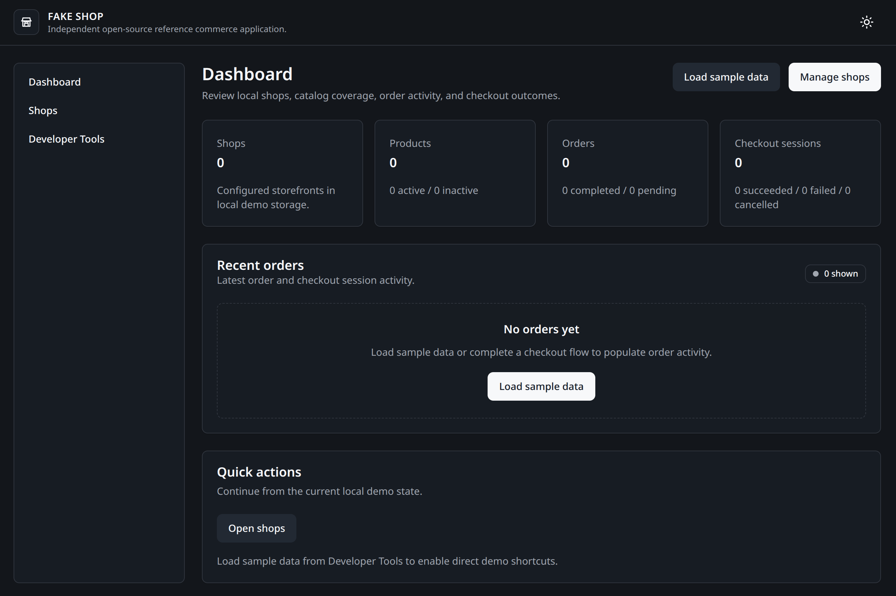

# fake-shop

fake-shop is an independent open-source reference commerce application for local demos and checkout integration experiments.

It provides a small but realistic commerce flow that developers can run locally, inspect, test, and extend without external infrastructure or production commerce setup.

## What It Includes

- shop management;
- product catalog management;
- cart and checkout preparation;
- customer information capture;
- order and checkout session visibility;
- default mock checkout adapter;
- external checkout adapter boundary for future experiments;
- local demo data, reset, and inspection tools;
- unit, integration, end-to-end, and smoke tests.

fake-shop is not a production ecommerce platform, payment processor, banking system, accounting system, or settlement system.

## Screenshots



## Quick Start

Docker is the recommended first-run experience for fake-shop v0.2.0. It provides a reproducible
local runtime without changing the application's local-first architecture.

Requirement:

- Docker with Compose support.

Build and start fake-shop:

```bash
docker compose up --build
```

Open:

```text
http://127.0.0.1:3000
```

No database, external service, or credentials are required. Mock checkout works by default.

## First Demo

Open developer tools:

```text
http://127.0.0.1:3000/developer
```

Select `Load sample data`, then follow the demo links through:

- sample shop;
- products;
- checkout preparation;
- mock checkout;
- orders;
- integration settings.

Shop, demo, and checkout state remains in the browser's `localStorage`. The container does not
move application state to a server or automatically load sample data.

## Native Contributor Workflow

Contributors can run the same application directly with Node.js 22.13 or newer and pnpm 11 or
newer:

```bash
pnpm install
pnpm run dev
```

Open:

```text
http://localhost:3000/developer
```

Docker is optional for native development. Both workflows preserve the same mock-default checkout,
provider-neutral adapter, and browser-local persistence behavior.

## Checkout Model

fake-shop uses a provider-neutral checkout session lifecycle:

- `created`;
- `pending`;
- `succeeded`;
- `failed`;
- `cancelled`.

The mock checkout adapter supports success, failure, and cancellation scenarios. The external adapter boundary is present for future integration experiments, but it does not call external services by default.

## Development Commands

```bash
pnpm run check
pnpm run test
pnpm run build
```

Additional validation:

```bash
pnpm run demo:check
pnpm run smoke:routes
```

`pnpm run smoke:routes` expects the application to be running locally.

## Development Boundaries

fake-shop is an open-source reference commerce application. Repository boundaries are intentional:
source code, documentation, tests, and scripts each have separate responsibilities.

Source code boundaries:

- `src/` contains the current product implementation.
- Changes must follow the documented architecture and project structure.
- Domain code remains provider-neutral.
- Integrations stay behind checkout adapter boundaries.
- Storage is accessed through repository boundaries.
- UI components do not own business logic.

Local development boundaries:

- Mock checkout is the default development path.
- Sample data and reset/reseed workflows are supported.
- Local development should not require external services.

Experiment boundaries:

- Experiments and prototypes must not pollute main application code.
- Use feature branches for planned changes.
- Use local-only experiments or separate repositories when appropriate.
- Experiments must not introduce undocumented domain concepts, provider-specific assumptions, or temporary infrastructure dependencies.

Release stability rules:

- Documentation must match implementation.
- Tests must pass.
- Architecture boundaries must remain valid.
- Temporary development artifacts must be removed before merge.

Docker local runtime:

- `docker compose up --build` is the recommended first-run workflow.
- Docker provides a reproducible local development environment; it is not documented as a
  production deployment target.
- Native Node.js and pnpm commands remain available for contributors.
- Container packaging does not change browser-local state or the checkout integration model.

## Documentation

- [Documentation index](docs/README.md)
- [Getting Started](docs/guides/GETTING-STARTED.md)
- [Development Guide](docs/guides/DEVELOPMENT.md)
- [Configuration Guide](docs/guides/CONFIGURATION.md)
- [Integration Guide](docs/guides/INTEGRATION-GUIDE.md)
- [Testing Strategy](docs/testing/TESTING-STRATEGY.md)
- [Domain Model](docs/domain/DOMAIN-MODEL.md)
- [Checkout Model](docs/domain/CHECKOUT-MODEL.md)
- [Architecture](docs/architecture/FAKE-SHOP-ARCHITECTURE-v0.1.md)
- [Project Structure](docs/architecture/PROJECT-STRUCTURE.md)

## License

Apache License 2.0
